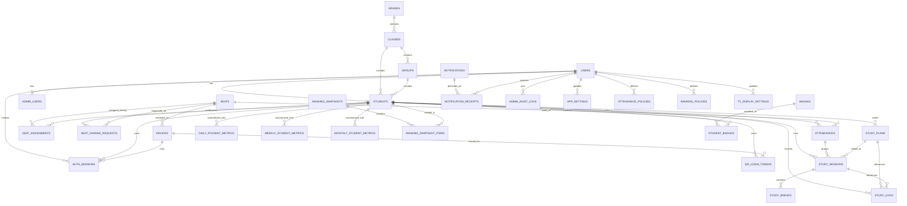
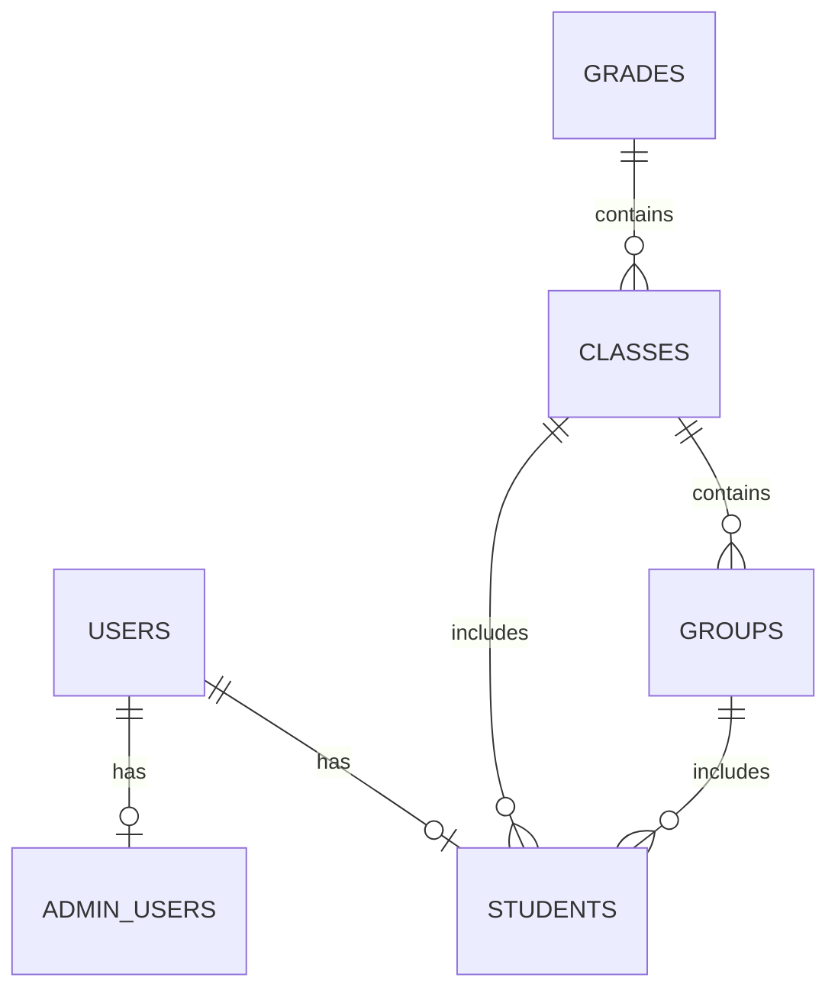
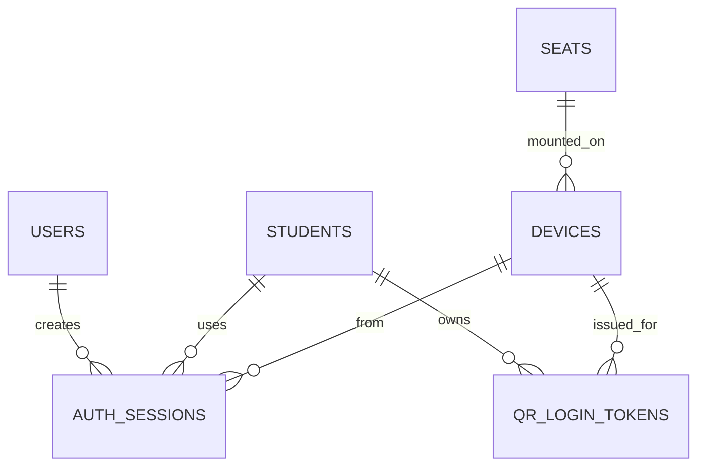
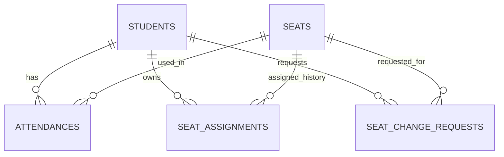
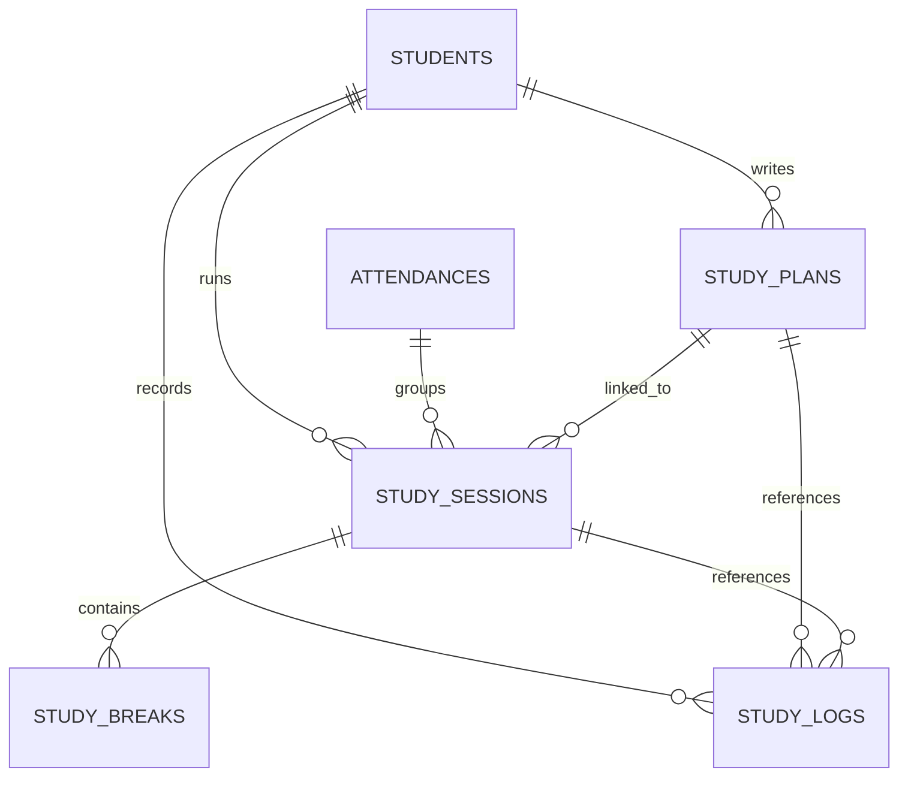
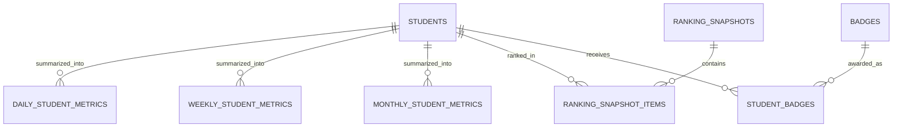
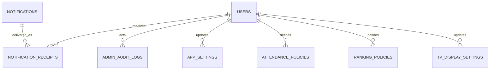

# STUDYON ERD

## 1. 문서 개요

- 제품명: `STUDYON`
- 문서명: `Entity Relationship Diagram`
- 문서 버전: `v1.0`
- 작성일: `2026-04-14`
- 문서 목적: STUDYON의 핵심 엔티티 관계를 시각적으로 정의하고, 개발/기획/디자인 간 데이터 구조 이해를 맞춘다.

---

## 2. ERD 설계 기준

이 ERD는 [DB_SCHEMA.md](/Users/bagjun-won/studyon/DB_SCHEMA.md)를 기준으로 작성했다.

### 설계 관점

- `기준 정보`
- `운영 이벤트 데이터`
- `집계/랭킹 데이터`
- `설정 데이터`

### 핵심 흐름

학생의 하루 흐름은 아래 데이터로 연결된다.

`학생 → 출결 → 좌석 → 계획 → 공부 세션 → 휴식 → 학습 기록 → 일간 집계 → 랭킹`

---

## 3. 전체 핵심 ERD

---

## 4. 도메인별 ERD

## 4-1. 사용자/조직 구조

### 해설

- `users`는 공통 인증 주체다.
- 학생은 `students`, 관리자와 원장은 `admin_users`로 세부 속성을 가진다.
- 학생은 `학년-반-그룹` 구조에 소속된다.

---

## 4-2. 인증/디바이스 구조

### 해설

- 학생 로그인, QR 로그인, 좌석 태블릿 자동 로그인 모두 `auth_sessions` 기준으로 관리한다.
- 좌석 태블릿은 `devices`와 `seats` 연결로 식별한다.
- QR 로그인은 단기 토큰 테이블로 분리한다.

---

## 4-3. 출결/좌석 구조

### 해설

- `attendances`는 학생의 일자별 출결 상태를 저장한다.
- `seat_assignments`는 좌석 배정 이력을 저장한다.
- `seat_change_requests`는 학생 요청 기반 좌석 변경 프로세스를 추적한다.

---

## 4-4. 학습 계획/세션/기록 구조

### 해설

- `study_plans`는 목표 데이터다.
- `study_sessions`는 실제 공부 시간 이벤트다.
- `study_breaks`는 세션 내부 휴식 구간이다.
- `study_logs`는 페이지 수, 문제 수, 진도율 같은 결과 데이터다.

즉, 이 구조는 `목표-행동-결과`를 분리 저장한다.

---

## 4-5. 집계/랭킹 구조

### 해설

- `daily/weekly/monthly_student_metrics`는 리포트와 대시보드용 집계 테이블이다.
- `ranking_snapshots`는 특정 기간/유형 기준 랭킹 계산 결과의 헤더다.
- `ranking_snapshot_items`는 실제 순위 목록이다.
- `student_badges`는 배지 지급 이력을 저장한다.

---

## 4-6. 알림/정책 구조

### 해설

- `notifications`는 메시지 원본이다.
- `notification_receipts`는 개별 수신자 단위 이력이다.
- `admin_audit_logs`는 관리자 조작 이력을 남긴다.
- 각 정책 테이블은 운영 규칙 변경 이력을 보존하기 위한 구조다.

---

## 5. 핵심 관계 해설

## 5-1. 학생과 사용자

- 모든 학생은 하나의 `users` 레코드를 가진다.
- 학생 전용 속성은 `students`에 저장한다.
- 관리자/원장은 `admin_users`에 저장한다.

즉, 인증 주체와 도메인 주체를 분리했다.

---

## 5-2. 출결과 공부 세션

- 학생은 하루에 하나의 `attendance`를 가진다.
- 하나의 출결에는 여러 `study_sessions`가 연결될 수 있다.
- 따라서 학생이 입실 후 여러 번 공부 시작/중지/재시작을 해도 출결은 하나로 유지된다.

---

## 5-3. 계획과 공부 결과

- `study_plans`는 목표
- `study_sessions`는 시간 기록
- `study_logs`는 학습량 기록

이 세 개를 연결하면 아래 분석이 가능해진다.

- 계획 대비 실제 공부 시간
- 계획 대비 실제 학습량
- 과목별 효율 분석

---

## 5-4. 좌석과 출결의 연결

- 학생은 현재 고정 좌석을 `students.assigned_seat_id`로 가진다.
- 실제 운영 이력은 `seat_assignments`에 기록한다.
- 당일 사용 좌석은 `attendances.seat_id`로 저장할 수 있다.

이 구조로 `고정 좌석`과 `당일 실제 좌석`을 구분한다.

---

## 5-5. 랭킹의 저장 방식

- 랭킹은 계산 결과를 즉시 재연산하지 않고 `snapshot`으로 저장한다.
- 이유는 아래와 같다.
  - TV 송출 안정성
  - 과거 순위 보존
  - 집계 비용 절감

---

## 6. MVP 핵심 엔티티

MVP 기준으로 우선 구현해야 하는 핵심 엔티티는 아래와 같다.

- `users`
- `students`
- `admin_users`
- `grades`
- `classes`
- `groups`
- `seats`
- `auth_sessions`
- `attendances`
- `seat_assignments`
- `study_plans`
- `study_sessions`
- `study_breaks`
- `study_logs`
- `daily_student_metrics`
- `ranking_snapshots`
- `ranking_snapshot_items`
- `notifications`

---

## 7. 권장 시각화 사용 방법

이 문서는 Mermaid 지원 환경에서 그대로 렌더링할 수 있다.

권장 활용 방식:

- 기획 리뷰: 전체 ERD 중심
- 백엔드 설계: 도메인별 ERD 중심
- 프론트엔드 협업: 계획/세션/기록 구조 중심
- 운영 정책 논의: 알림/정책 구조 중심

---

## 8. 최종 정의

STUDYON의 ERD는 단순 학생 관리 구조가 아니라,  
`학생의 하루 행동 데이터`와 `운영 실시간 관리 데이터`를 동시에 다루는 구조다.

핵심 축은 다음 4개다.

- 사용자/조직 축
- 출결/좌석 축
- 계획/세션/기록 축
- 집계/랭킹/정책 축

이 ERD를 기준으로 다음 단계인 `OpenAPI`, `Prisma schema`, `백엔드 프로젝트 구조`, `프론트 상태 모델`로 이어갈 수 있다.

